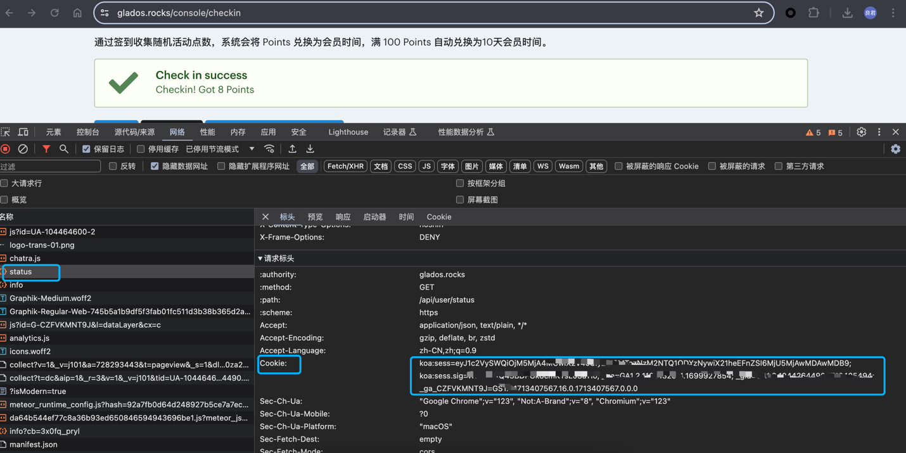

# GLaDOS_sign_in
GLaDOS auto sign in (GLaDOS自动签到，送免费时长)

## 快速开始

1、 获取GLaDOS的cookie值，方法如下：

- 打开浏览器，登录GLaDOS账号，进入[签到页面](https://glados.rocks/console/checkin)
- 按F12打开【开发者工具】，切换到【Network】选项卡
- 刷新页面，在【Network】选项卡中找到名为【status】的请求，点击展开详情，在【标头】里找到【Cookie】，复制出来备用


2、 运行自动签到程序

- 方法一，下载源码运行
```
git clone https://github.com/buliangjunpp/GLaDOS_sign_in.git
cd GLaDOS_sign_in/pkg
go build -o glados_signin glados.go
./glados_signin -cookie="GLaDOS_COOKIE_VALUE"
```
- 方法二，直接下载编译好的程序运行
```
wget https://github.com/buliangjunpp/GLaDOS_sign_in/releases/download/v1.0.0/glados_signin
chmod +x glados_signin
./glados_signin -cookie="GLaDOS_COOKIE_VALUE"
```

## 注意事项

程序的cookie指定可以通过命令行参数`-cookie`指定，也可以通过设置环境变量`GLADOS_COOKIE`指定，程序优先读取命令行参数，如果没有指定，则读取环境变量。
- 命令行参数：
```
./glados_signin -cookie="xxxxxxxx"
```
- 环境变量：
```
export GLADOS_COOKIE="xxxxxxxx"
./glados_signin
```

3、定时任务进行自动签到

可以使用定时任务工具，如`crontab`或`systemd`，定时运行程序，示例如下：
```
# 每天早上8点运行一次签到程序
0 8 * * * /path/to/glados_signin -cookie="GLaDOS_COOKIE_VALUE"
```
